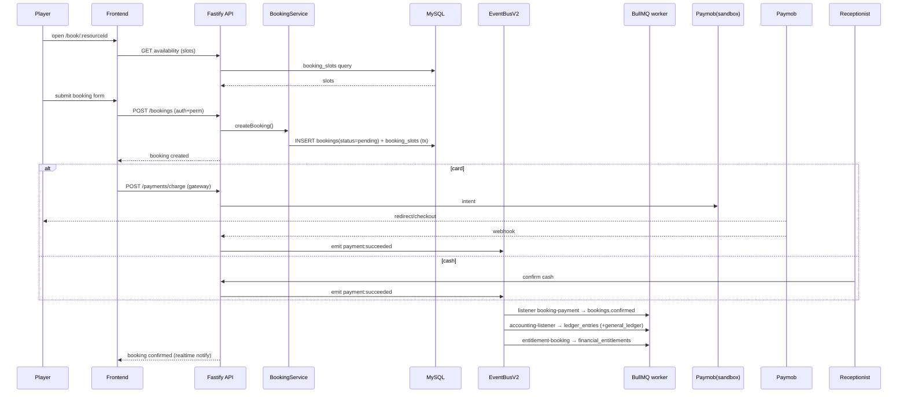
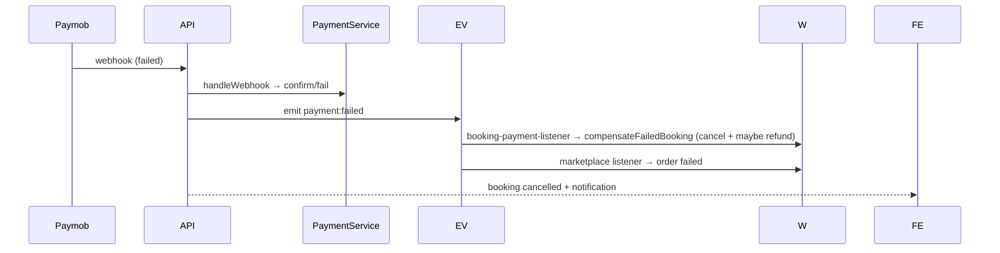
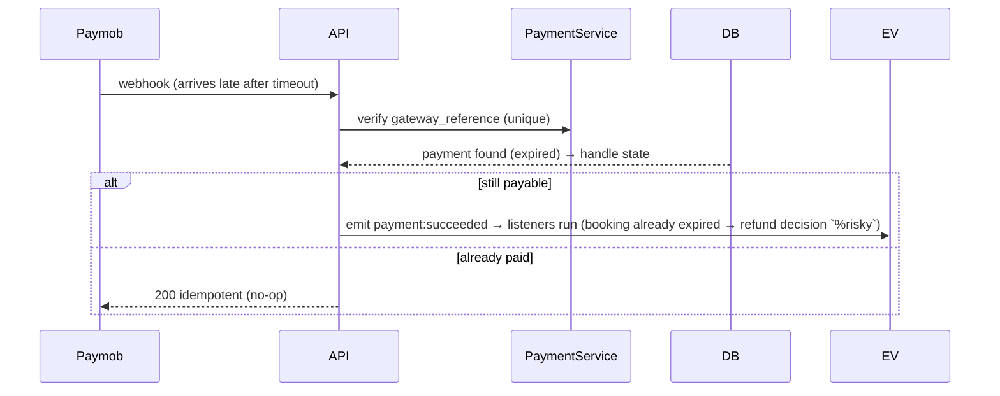
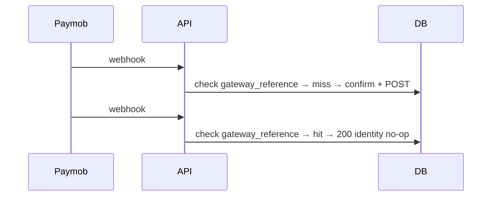
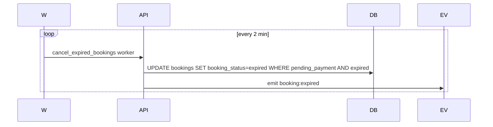
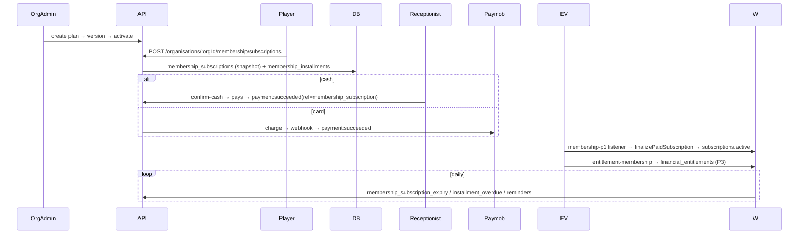
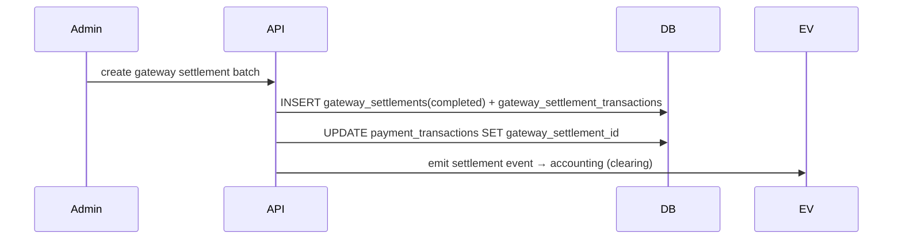
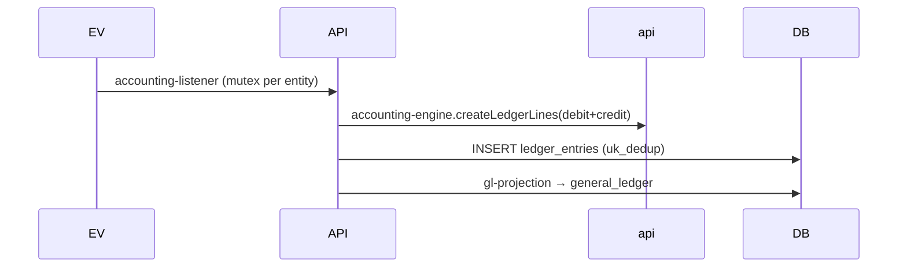
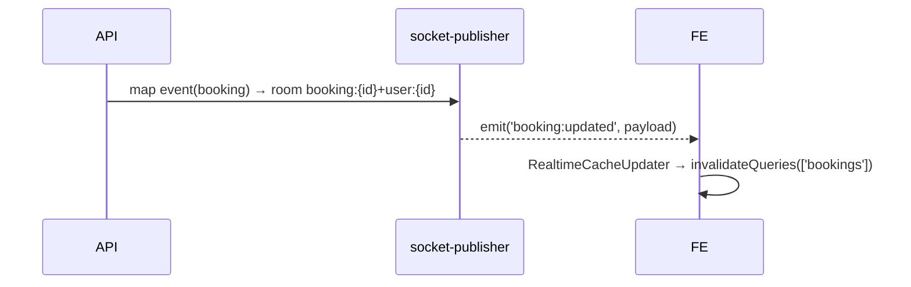

# 19 — SEQUENCE DIAGRAMS

**Audit:** 2026-10-04 · Diagrams reflect the CURRENT code behavior (verified parts) + assumptions marked `%%`.

---

## 1. Normal court booking (cash or card)



## 2. Card booking / 3. Cash booking — covered above (card vs cash branch).

## 4. Failed payment



## 5. Late webhook


`%% Late-webhook ordering vs booking expiry needs UAT (see 09, 22).`

## 6. Duplicate webhook



## 7. Booking expiration



## 8. Cancellation

```mermaid
sequenceDiagram
  P->>API: POST /bookings/:id/cancel
  API->>BK: cancelBooking (window policy + policy snapshot)
  API->>DB: INSERT booking_cancellations(booking_id UNIQUE, refund_status)
  API->>EV: emit booking:cancelled (+ payment:refunded if paid)
  EV->>W: accounting → reversal entries; entitlement → cancel
```

## 9. Refund

```mermaid
sequenceDiagram
  Admin/Receptionist->>API: POST /payments/:id/refund (perm)
  API->>PaymentService: refund(amount, reason)
  API->>DB: payment_transactions.status=refunded
  API->>EV: emit payment:refunded
  EV->>W: booking_cancellations processed; ledger reversal; wallet credit (if wallet)
```

## 10. Marketplace purchase

```mermaid
sequenceDiagram
  Buyer->>API: POST /marketplace/cart (reservation)
  Buyer->>API: POST /marketplace/checkout
  API->>DB: INSERT orders (per seller) + order_items (stock decrement ⚠️ lock unverified)
  API->>Paymob: charge
  Paymob->>API: webhook → payment:succeeded (ref=order)
  API->>EV: marketplace-payment-listener → orders.confirmed
  EV->>W: entitlement-marketplace → entitlements; ledger entries
```

## 11. Marketplace refund — like #9 but `settlement_status` on order_items + marketplace refund calc.

## 12. Membership purchase



## 13. Gateway settlement



## 14. Accounting posting



## 15. Realtime booking update



## 16. Notification flow

```mermaid
sequenceDiagram
  EV->>API: notification-engine.handleEvent(event)
  API->>API: dispatcher (rate-limit, quiet, prefs)
  API->>W: BullMQ notifications queue (per channel)
  W->>Provider: deliver (InApp/Email real; Push/SMS mock)
  W->>DB: notification_delivery + notification_audit_trail
  W-->>FE: in-app via socket user:{id}
```