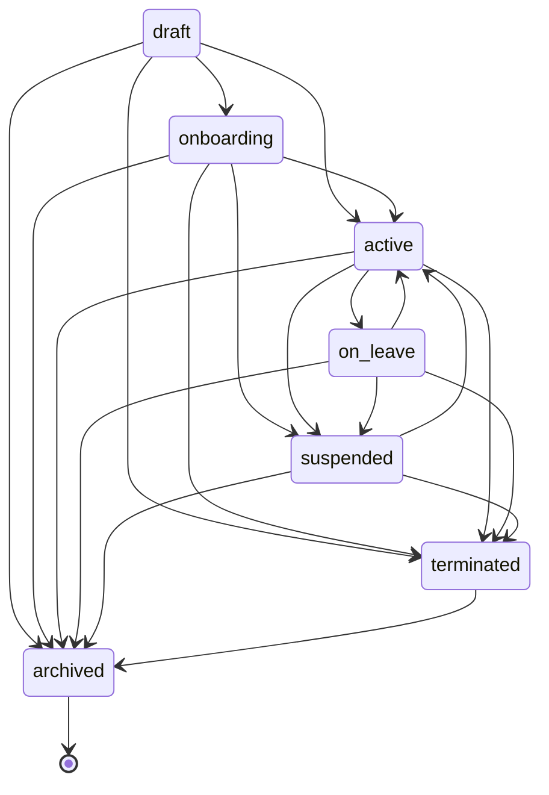
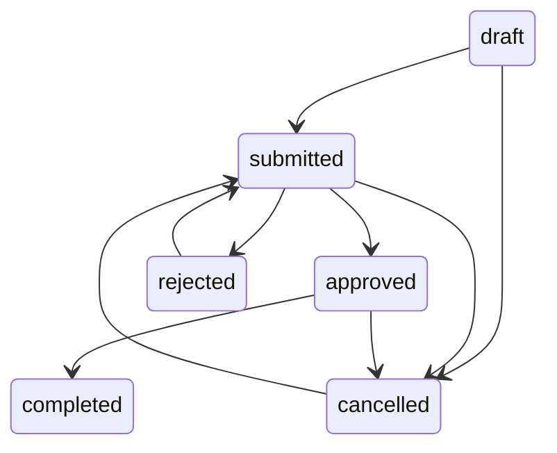
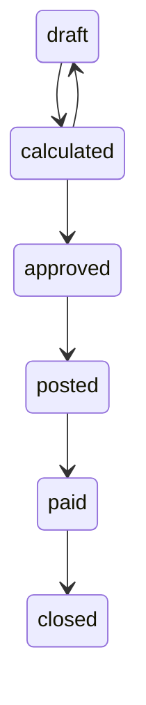

# HR Architecture (TECH-ARCH-23)

**Source:** `backend/src/modules/hr/` (`hr.controller.ts:1-1544`, `hr.routes.ts:1-81`)

## 1. State Machine Pattern

All HR entities use a **validated state transition pattern**. The `assertValidTransition()` helper (`hr.controller.ts:14-19`) enforces that status changes follow a predefined transition map:

```typescript
function assertValidTransition(current: string, next: string, validTransitions: Record<string, string[]>): void {
  const allowed = validTransitions[current];
  if (!allowed || !allowed.includes(next)) {
    throw new AppError(`Invalid state transition from '${current}' to '${next}'`, 400, 'VALIDATION_ERROR');
  }
}
```

Three entities use state machines: **Employees**, **Leave Requests**, **Payroll Runs**. Contracts use a simpler variant.

**Evidence:** `hr.controller.ts:14-19`

---

## 2. Departments

Simple CRUD with hierarchical self-reference (`parent_id`).

| Endpoint | Handler | Permission |
|----------|---------|------------|
| `GET /hr/departments` | `listDepartmentsHandler` | `hr.departments.view` |
| `GET /hr/departments/:id` | `getDepartmentHandler` | `hr.departments.view` |
| `POST /hr/departments` | `createDepartmentHandler` | `hr.departments.manage` |
| `PUT /hr/departments/:id` | `updateDepartmentHandler` | `hr.departments.manage` |
| `DELETE /hr/departments/:id` | `deleteDepartmentHandler` | `hr.departments.manage` |

**Schema:** `departments` (`database/migrations/070_hr_payroll.sql:2-15`). Key fields: `organisation_id`, `parent_id`, `head_employee_id`, `is_active`.

**Evidence:** `hr.routes.ts:9-13`, `hr.controller.ts:23-134`

## 3. Positions

Simple CRUD linked to departments. Soft-delete via `is_active = 0`.

**Schema:** `positions` (`database/migrations/070_hr_payroll.sql:18-31`). Key fields: `organisation_id`, `department_id`, `title`, `is_active`.

**Evidence:** `hr.routes.ts:16-20`, `hr.controller.ts:138-248`

---

## 4. Employee Lifecycle

### Status: `draft → onboarding → active → on_leave → suspended → terminated → archived`



**Transition map** (`hr.controller.ts:252-260`):

```typescript
const EMPLOYEE_TRANSITIONS: Record<string, string[]> = {
  draft: ['onboarding', 'active', 'terminated', 'archived'],
  onboarding: ['active', 'terminated', 'suspended', 'archived'],
  active: ['on_leave', 'suspended', 'terminated', 'archived', 'onboarding'],
  on_leave: ['active', 'terminated', 'suspended', 'archived'],
  suspended: ['active', 'terminated', 'archived', 'on_leave'],
  terminated: ['archived'],
  archived: [],
};
```

**Schema:** `employees` (`database/migrations/070_hr_payroll.sql:34-57`). Extends `users` with `employee_code`, `employment_status`, `hire_date`, `termination_date`, `reports_to`. UNIQUE on `(user_id, organisation_id)`.

**CRUD endpoints:** `hr.routes.ts:23-27`
- `GET /hr/employees` — List with filters (org, dept, position, status, search)
- `GET /hr/employees/:id` — Get single employee
- `POST /hr/employees` — Create (validates duplicate user+org)
- `PUT /hr/employees/:id` — Update fields
- `PATCH /hr/employees/:id/status` — Change status with transition validation

**Evidence:** `hr.controller.ts:252-400`

---

## 5. Employment Contracts Lifecycle

### Status: `draft → active → expired → terminated`

```typescript
const CONTRACT_TRANSITIONS: Record<string, string[]> = {
  draft: ['active', 'terminated'],
  active: ['expired', 'terminated'],
  expired: [],
  terminated: [],
};
```

**Schema:** `employment_contracts` (`database/migrations/070_hr_payroll.sql:60-76`). Key fields: `contract_type` (permanent, fixed_term, probation, internship, freelance), `salary_amount`, `payment_frequency`, `document_url`.

**Evidence:** `hr.controller.ts:404-529`, `hr.routes.ts:30-34`

---

## 6. Leave Management

### 6.1 Leave Types (Configurable)

Per-organisation configuration:

| Column | Description |
|--------|-------------|
| `name` | e.g. Annual, Sick, Personal |
| `default_days` | Default allocation per year |
| `is_paid` | Paid or unpaid |
| `requires_approval` | Whether leave requires manager approval |

**Schema:** `leave_types` (`database/migrations/070_hr_payroll.sql:79-90`)

**Evidence:** `hr.controller.ts:533-628`, `hr.routes.ts:37-41`

### 6.2 Leave Requests — 6-State Lifecycle

### Status: `draft → submitted → approved → completed → [terminal]` with `rejected` and `cancelled` branches



**Transition map** (`hr.controller.ts:632-639`):

```typescript
const LEAVE_TRANSITIONS: Record<string, string[]> = {
  draft: ['submitted', 'cancelled'],
  submitted: ['approved', 'rejected', 'cancelled'],
  approved: ['completed', 'cancelled'],
  rejected: ['submitted'],
  cancelled: ['submitted'],
  completed: [],
};
```

**Approval flow** (`approveLeaveRequestHandler`, `hr.controller.ts:758-814`):
1. `SELECT ... FOR UPDATE` locks the leave request row
2. `SELECT ... FOR UPDATE` locks the `leave_balances` row
3. Validates balance not exceeded (`used_days + duration_days <= total_days`)
4. Updates `used_days` and `pending_days` on leave_balances
5. Updates leave request status to `approved`, sets `approved_by` and `approved_at`
6. All within a transaction

**Cancellation of approved leaves** (`cancelLeaveRequestHandler`, `hr.controller.ts:844-894`):
- Reverses `used_days` deduction on leave_balances
- Only modifies balance if the cancelled status was `approved`

**Schema:** `leave_requests` (`database/migrations/070_hr_payroll.sql:93-111`)

**Evidence:** `hr.controller.ts:630-894`, `hr.routes.ts:44-51`

### 6.3 Leave Balances (Auto-Calculated)

Per-employee, per-leave-type, per-year.

| Column | Description |
|--------|-------------|
| `total_days` | Annual entitlement |
| `used_days` | Days taken (incremented on approval) |
| `pending_days` | Days in pending/approved requests |

**Schema:** `leave_balances` (`database/migrations/070_hr_payroll.sql:114-125`). UNIQUE on `(employee_id, leave_type_id, year)`.

**Adjust endpoint:** `POST /hr/leave-balances/adjust` — upsert pattern (INSERT or UPDATE by employee + leave type + year).

**Evidence:** `hr.controller.ts:898-956`, `hr.routes.ts:54-55`

---

## 7. Staff Attendance Tracking

### Clock In/Out Flow

| Action | Endpoint | Logic |
|--------|----------|-------|
| Clock In | `POST /hr/attendance/clock-in` | Inserts record for today (`employee_id + today` = UNIQUE). Status defaults to `present`. |
| Clock Out | `POST /hr/attendance/clock-out` | Updates existing today's record with `clock_out` time. Validates not already clocked out. |
| Manual Log | `POST /hr/attendance/log` | Inserts record for any date with explicit status. |
| List | `GET /hr/attendance` | Filterable by employee, date range, status. |

**Statuses:** `present`, `absent`, `late`, `early_leave`, `excused`

**Schema:** `staff_attendance` (`database/migrations/070_hr_payroll.sql:128-141`). UNIQUE on `(employee_id, attendance_date)`.

**Evidence:** `hr.controller.ts:960-1084`, `hr.routes.ts:58-61`

---

## 8. Payroll Components (Configurable)

Per-organisation earning/deduction types.

| Column | Description |
|--------|-------------|
| `type` | `earning` or `deduction` |
| `calculation_type` | `fixed` (flat amount), `percentage` (of base salary), `formula` |
| `default_amount` | Default value for calculation |

**Schema:** `payroll_components` (`database/migrations/070_hr_payroll.sql:144-155`)

**Evidence:** `hr.controller.ts:1088-1175`, `hr.routes.ts:64-67`

---

## 9. Payroll Run Lifecycle

### Status: `draft → calculated → approved → posted → paid → closed`



**Transition map** (`hr.controller.ts:1179-1186`):

```typescript
const PAYROLL_TRANSITIONS: Record<string, string[]> = {
  draft: ['calculated'],
  calculated: ['approved', 'draft'],
  approved: ['posted'],
  posted: ['paid'],
  paid: ['closed'],
  closed: [],
};
```

### Calculation Logic (`calculatePayrollRunHandler`, `hr.controller.ts:1259-1349`)

1. Loads active/on_leave employees with their active contracts to get `salary_amount`
2. Deletes stale `payroll_entries` if re-calculating
3. For each employee:
   - Loads active `payroll_components` for the organisation
   - Calculates earnings (fixed amount or % of base salary)
   - Calculates deductions (same logic)
   - Computes `net_pay = base_salary + total_earnings - total_deductions`
   - Stores `component_breakdown` as JSON in `payroll_entries`
4. Aggregates `total_gross`, `total_deductions`, `total_net` on `payroll_runs`
5. Sets status to `calculated`

### Post to Finance (`postPayrollRunHandler`, `hr.controller.ts:1376-1445`)

1. Validates transition to `posted`
2. For each `payroll_entry`, creates **double-entry** `general_ledger` records:
   - Debit account (ID=1): employee's `net_pay`
   - Credit account (ID=5): employee's `net_pay`
3. References the open `accounting_period` that contains `period_end`
4. Sets `posted_at`, `posted_by`

**Schema:** `payroll_runs` (`database/migrations/070_hr_payroll.sql:158-178`), `payroll_entries` (`180-193`)

**Evidence:** `hr.controller.ts:1177-1498`, `hr.routes.ts:70-78`

---

## 10. HR Dashboard

`GET /hr/dashboard` returns:
- `employeesByStatus` — GROUP BY `employment_status`
- `totalDepartments` — COUNT active departments
- `pendingLeaveRequests` — COUNT leave requests with `status = 'submitted'`
- `activePayrollRuns` — COUNT payroll runs in draft/calculated/approved
- `attendanceToday` — COUNT staff_attendance for `CURDATE()` with clock_in

**Evidence:** `hr.controller.ts:1502-1544`

---

## 11. API Routes Summary

| Group | Routes | Permissions |
|-------|--------|-------------|
| Departments | 5 | `hr.departments.view`, `hr.departments.manage` |
| Positions | 5 | `hr.positions.view`, `hr.positions.manage` |
| Employees | 5 | `hr.employees.view`, `hr.employees.manage` |
| Contracts | 5 | `hr.contracts.view`, `hr.contracts.manage` |
| Leave Types | 5 | `hr.leaves.types.view`, `hr.leaves.types.manage` |
| Leave Requests | 9 | `hr.leaves.requests.*` |
| Leave Balances | 2 | `hr.leaves.balances.*` |
| Attendance | 4 | `hr.attendance.view`, `hr.attendance.manage` |
| Payroll Components | 4 | `hr.payroll.components.*` |
| Payroll Runs | 8 | `hr.payroll.runs.*` |
| Dashboard | 1 | `hr.dashboard.view` |

**Total:** 53 endpoints. **Source:** `hr.routes.ts:9-81`
